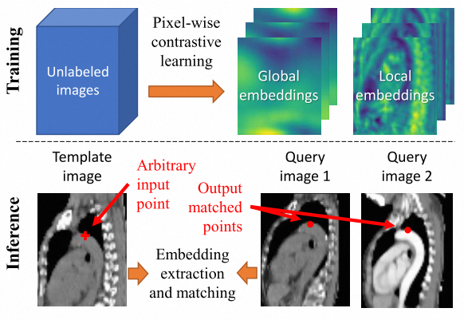
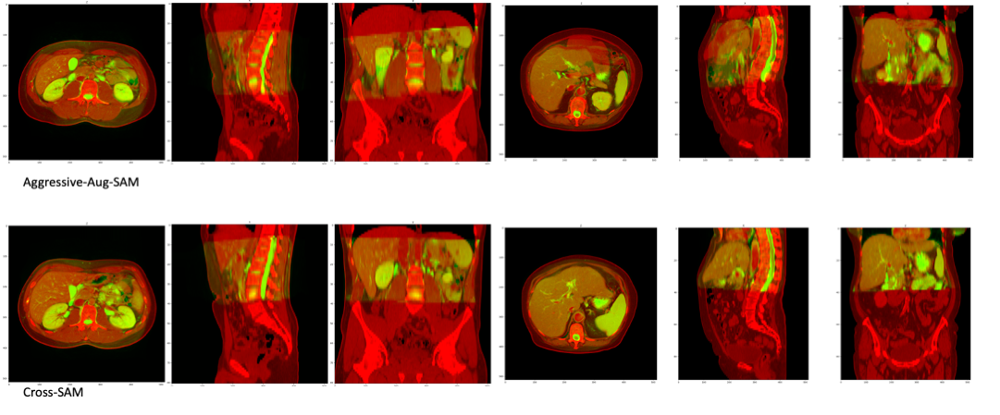

# Frameworks

### SAM

See [arXiv](https://arxiv.org/abs/2012.02383). Flowchart:

Network and loss:

### UAE-S

See [arXiv](https://arxiv.org/abs/2306.13988). Semantic head:

Structural inference (fixed-point iteration):

### UAE-M

See [arXiv](https://arxiv.org/abs/2307.03535).

Flowchart:

MRI to CT point matching results:

UAE-M can be used for cross-modality registration, even if the two modalities have large FOV difference, see the 
following examples with large CT images and small MR ones. 

We first use aggressive data augmentation to train UAE-M0 to find grid matching points
on the CT-MRI data, and then do rigid registration, followed by DEEDS deformable fine-tuning.

The UAE-M0 is trained using only intra-modality data and would result some false alignment but the overall body part is correct.
UAE-M is trained on top of the registration results of the UAE-M0. 

